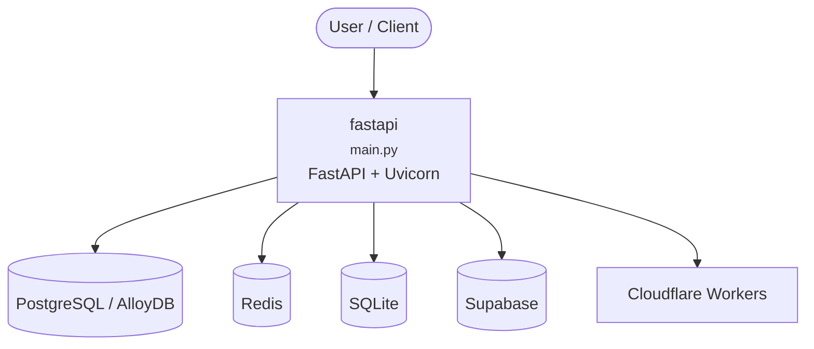

# Context Map — `fastapi`

> Auto-generated architecture & deployment context map. Summarizes the core application, container/cloud footprint, and database connections. Regenerate after significant structural changes.

**Repo:** `avnit/fastapi` · **Fork** · Public · Primary language: Python · Default branch: `master` · Files: 3131

**Description:** FastAPI framework, high performance, easy to learn, fast to code, ready for production

## 1. Core application

<em>FastAPI framework, high performance, easy to learn, fast to code, ready for production</em>

- **Frameworks / runtime:** FastAPI + Uvicorn, Gunicorn
- **Entry points:** `docs_src/app_testing/app_a_py310/main.py`, `docs_src/app_testing/app_b_an_py310/main.py`, `docs_src/app_testing/app_b_py310/main.py`, `docs_src/async_tests/app_a_py310/main.py`, `docs_src/bigger_applications/app_an_py310/main.py`, `docs_src/settings/app01_py310/main.py`
- **Listens on port(s):** 8000

## 2. Containers & cloud applications

**Detected cloud platforms / services:** Cloudflare Workers

## 3. Database connections

**Datastores in use:** PostgreSQL / AlloyDB, Redis, SQLite, Supabase

**Referenced in:**
- `docs/en/data/topic_repos.yml`
- `docs_src/sql_databases/tutorial001_an_py310.py`
- `docs_src/sql_databases/tutorial001_py310.py`
- `docs_src/sql_databases/tutorial002_an_py310.py`
- `docs_src/sql_databases/tutorial002_py310.py`
- `tests/test_inherited_custom_class.py`

## 4. Architecture diagram

## 5. Security posture

- **Dependabot alerts (open):** 22 high, 4 medium
- **Static scan findings:** 8 high, 24 medium, 54 low

| Severity | Rule | File:Line |
|---|---|---|
| high | generic-secret-assign | `docs_src/security/tutorial004_an_py310.py:13` |
| high | generic-secret-assign | `docs_src/security/tutorial004_py310.py:12` |
| high | generic-secret-assign | `docs_src/security/tutorial005_an_py310.py:17` |
| high | generic-secret-assign | `docs_src/security/tutorial005_py310.py:16` |
| high | generic-secret-assign | `fastapi/.agents/skills/fastapi/references/responses.md:76` |
| high | generic-secret-assign | `tests/test_filter_pydantic_sub_model_pv2.py:34` |
| high | generic-secret-assign | `tests/test_tutorial/test_security/test_tutorial004.py:167` |
| high | generic-secret-assign | `tests/test_tutorial/test_security/test_tutorial005.py:193` |

---
_Generated by repo context-mapping pass on 2026-08-13._